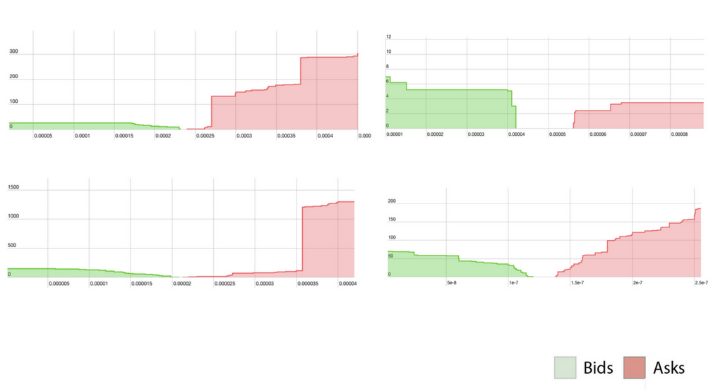

# Coding assignment

Welcome! Good to have you.

In this coding assignment, we're going to build an interface for an order book. In essence, an order book
is the collection of bids (sell orders) and asks (buy orders) that an exchange holds at a point in time.
It tells us what quantities of an asset are available at what price.

Automated trading systems use the order book (among other things, of course) to determine optimal order volumes and prices
depending on exchange conditions. The bids and asks "meet" at a certain range of values, referred to as the "bid-ask-spread" (or just "spread"). This spread determines what we think of as the "price" of an asset.

If all of this sounds a little unfamiliar, don't worry about it. We'll be converting this abstract concept to something more tangible very soon.

## Getting the data

For this assignment we'll use Kraken as our exchange, and ETH/USD as our asset/pair. If needed, you can find the documentation of the order book API [here](https://docs.kraken.com/rest/#operation/getOrderBook).

To get started, you can fetch the order book from the following URL: `https://api.kraken.com/0/public/Depth?pair=ethusd`.

## Requirements

We'll go through a couple of exercises, each of which will be slightly more complex than the previous. There will likely to be more exercises than we have time for, and that's okay. We're not interested in seeing how much code you can write in an arbitrary amount of time, but rather how you reason about the problem, communicate with the team, and the effectiveness of your solutions.

We encourage you to emphasize quality over quantity, and to ask whatever questions you feel the need to ask.

## Part 1: the interface

1. Build an abstraction that, given a pair as an argument (`ethusd` in our case) fetches the latest orderbook and prints it.

2. Add some functionality that takes a side (bid or ask) and a price _p_ as arguments, and returns the total volume available in the order book at _p_.

3. Now add some (or modifies existing) functionality that takes a percentage and a side as arguments, and returns the volume available between the best price for that side, and that price +/- the percentage.

4. Can you visualize the order book?

## Part 2: time-series

1. Build an abstraction that takes the following arguments:
   - A pair
   - A unit of time (_t_) that can be either "milliseconds", "seconds", "minutes" or "hours".
   - A number of time units (_n_)

    Given these arguments, it should fetch and store the order book for the pair every _n_ _t_. For example: if _t_ = "second" and _n_ = 3, it should fetch the order book every second for a total of 3 times.

2. Now extend your code to compare the order books you've fetched to each other. Given the name of a pair, _n_, _t_ and a price _p_, determine how much the total volume available at _p_ has changed between each "frame", and between the first and last "frame".

3. Can you think of an efficient way to get a "diff" of two frames? For example, can you think of a way to determine at which price the volume changed the most?

## Wrapping up

Whew, you made it! Please commit and push your changes to a branch that contains your name, in case we want to take another look at your beautiful code.